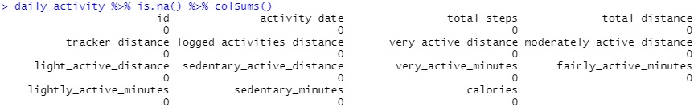

# Case study "Bellabeat"

## Introduction

This is a case study about "Bellabeat", a high-tech manufacturer 
of health-focused products for women. The goal of the study is to
analyze smart device fitness data and make recommendations for 
marketing strategy.

## Business task and stakeholders

**Questions for the analysis:**  
What are some trends in smart device usage?  
How could these trends apply to Bellabeat customers?  
How could these trends help influence Bellabeat marketing strategy?

**Business task:**  
Identify patterns in data, how consumers use Bellabeat smart devices,
and make high-level recommendations for Bellabeat’s marketing strategy.

**Key stakeholders:**  
*Urška Sršen*: Bellabeat’s cofounder and Chief Creative Officer   
*Sando Mur*: Mathematician and Bellabeat’s co-founder; key member of the Bellabeat executive team

## Data integrity

*Dataset:* FitBit Fitness Tracker Data  
*Generated:* by respondents to a distributed survey via Amazon Mechanical Turk   
*Time:* between 03.12.2016-05.12.2016   
*Sample group:* Thirty Fitbit users   
*License:* CC0: Public Domain  
  
**Data limitations** and credibility exist, due to small sample size with limited 
information about participants. Dataset is outdated and collected by third party. 

## Data cleaning

Loading libraries:  
```
library(tidyverse)    
library(skimr)   
library(janitor)    
library(ggplot2)
```

Importing datasets:  
Originally datasets exists in CSV format.   
For analysis 2 main datasets will be used, as it combines data from smaller datasets.  
The files were then imported into R Studio for further analysis.  
```
daily_activity <- read.csv("Fitabase Data 4.12.16-5.12.16/dailyActivity_merged.csv")
sleep_day <- read.csv("Fitabase Data 4.12.16-5.12.16/sleepDay_merged.csv")
```

Cleaning empty spaces and column names:  
```
daily_activity <- clean_names(daily_activity)  
sleep_day <- clean_names(sleep_day) 
```
Fixing wrong column format for date and time:  
```
daily_activity$activity_date <- as.Date(daily_activity$activity_date, "%m/%d/%Y") 
sleep_day$sleep_day <- as.POSIXct(sleep_day$sleep_day, format = "%m/%d/%Y %H:%M:%S")
``` 
  

Checking if there is any missing value:    

`daily_activity %>% is.na() %>% colSums()`
  

`sleep_day %>% is.na() %>% colSums()`  
  

Checking if data is within the acceptable range  
Sum of minutes cannot be more, than 1440 (minutes in one day):
```
daily_activity %>%      
mutate(daily_activity, all_minutes = (very_active_minutes + 
fairly_active_minutes + lightly_active_minutes + sedentary_minutes)) %>%
select(id,              
all_minutes) %>%      
filter(all_minutes > 1440)
```
     

Time asleep cannot be more, than time in bed:  
```
sleep_day %>%  
  select(id,
         total_minutes_asleep,
         total_time_in_bed) %>%
  filter(total_minutes_asleep > total_time_in_bed)
```
     

## Analysis  
### Statistics 

We can see some key statistic data using the `summary()` function 
     
Fitbit user makes 7638 steps per day on average, which is lower than
National Institutes of Health recommends. Taking 8,000 steps per day was 
associated with a 51% lower risk for all-cause mortality [^1].   

Average active time is 21,16 minutes, which equals to 148.12 minutes a 
week. CDC recommends [^2] at least 150 minutes of moderate-intensity physical 
activity or 75 minutes of vigorous-intensity physical activity per week. Fitbit 
users do enough suggested activity per week.  

Amount of sedentary times in some measurements reaches up to 100% of all users 
daily time. Sedentary behavior has been identified [^3] as a risk factor for a variety 
of chronic health conditions.   

Data shows, that on average, user burns 2304 calories. In average, female consume 
1833 calories [^4] per day. This means, that maintaining active lifestyle, users can contain a 
healthy weight. 


Average sleep time for Fitbit users is 419.5 minutes, which is equal to 7 hours.
CDC recommends [^5] for adults to get at least 7 hours of sleep.  

Users average time in bed is 458.6 minutes, while average sleep time is 419.5, what
makes falling asleep time to be 39.1 minutes. Falling asleep longer, than 20 minutes
could be connected to insomnia [^6]. 

### Distance vs Calories  

  
Graph above shows positive correlation between distance traveled and calories burned. The more
distance is traveled, more calories are burned. 

### Time to fall asleep vs Daily activity

For the next analysis, I need both datasets to be combined (inner join, as not all users 
have whole data tracked):   
```
combined_data <- merge(sleep_day, daily_activity, by="id")
```
  
Graph above shows impact of active lifestyle on time to get asleep. As we can see, users,
 who was very active for at least 60 minutes (2) a day, would take significantly less time to
fall asleep, than users, who had 20 minutes (1) or less of active minutes a day. 

## Conclusion

Due to limitations of data, I would suggest to do a deeper research, using more and current
data. I would recommend having more study participants, collecting data for longer time period,
obtaining more data about users, like gender, age, occupancy etc.   

Based on obtained and analyzed data, my marketing strategy suggestions would be:     

- Targeting new people or current users, who lack daily activity and implementing function 
to alert user. Study showed, that users lack daily activity, like having bigger sedentary time 
per day or not having enough amount of steps. Smart device would alert user, based on their 
current activity, promoting to move now or more. 
- Target people with sleep problems. Study shows, that implementing active lifestyle, sleep 
patterns could improve. As smart device can track time asleep and time in bed, it can make 
recommendations based on this data and Health officials suggestions, that could improve
sleep habits. 
- Target active fitness users, who would like to improve their lifestyle. Having daily activity
and sleep data tracked helps to find weak points and eliminate it.  

## References:

[^1]: "Higher Daily Step Count Linked with Lower All-cause Mortality" 
Centers for Disease Control and Prevention, March 24, 2020, https://www.cdc.gov/media/releases/2020/p0324-daily-step-count.html  
[^2]: "How much physical activity do adults need?" 
Centers for Disease Control and Prevention, March 17, 2022, https://www.cdc.gov/physicalactivity/basics/adults/index.htm  
[^3]: "Prevalence of Sedentary Leisure-time Behavior Among Adults in the United States"
Centers for Disease Control and Prevention, November 6, 2015, https://www.cdc.gov/nchs/data/hestat/sedentary/sedentary.htm#:~:text=Sedentary%20behavior%20has%20been%20identified,colon%20cancer,%20and%20diabetes%20mellitus.&text=About%2040%25%20of%20U.S.%20adults,physical%20activities%20of%20any%20kind.  
[^4]: "Intake of Calories and Selected Nutrients for the United States Population, 1999-2000"
Centers for Disease Control and Prevention, https://www.cdc.gov/nchs/data/nhanes/databriefs/calories.pdf,
[^5]: "How Much Sleep Do I Need?" Centers for Disease Control and Prevention, March 2, 2017, 
https://www.cdc.gov/sleep/about_sleep/how_much_sleep.html  
[^6]: "How Long Should It Take to Fall Asleep?" Matthew Whittle, October 8, 2021,
https://www.sleep.org/sleep-questions/how-long-to-fall-asleep/